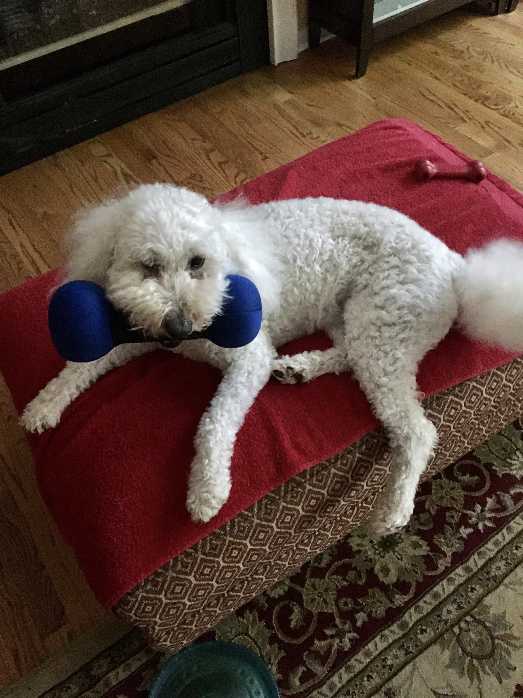

<h1 align="center"> Hi, I'm Henry Vogel   </h1>
I'm an 18 year old Computer Science student attending Wake Tech, for an Information Technology A.A.S in Computer Programming and Development. Outside of my degree, I’ve spent time working towards and earning various certifications; with some of these earned being the

* **CompTIA IT Fundamentals+ Certification**
* **Python: Information Technology Specialist Certification** *and the*
* **Cisco Certified Support Technician (CCST) Networking Certification** 

Currently I'm working on improving my website and network management and design, as well as trying to solidify my baseline computer knowledge. I'm currently learning more about database management (and things surrounding that) and I want to improve my Python skills. I'm also slowly working on creating a couple Steam games as a fun side project. I love dogs and have two dogs that always want attention. I also love game design, reading, and hiking, as well as trying out new videogames and grinding out achievements in those games. 

# 🌐 Socials:

# 💻 Tech Experience & Exposure:
#### Languages

#### Hosting/SaaS

#### Frameworks, Platforms, & Libraries
 

#### Servers

#### Databases / ORM

#### Design & Visual Tools

#### Version Control + CI/CD

#### Other Sites

# 📊 A Few GitHub Stats:
 
 

### ✍️ Your Quote:

## Gallery

<table>
    <tr>
        <td></td>
        <td></td>
        <td></td>
        <td></td>
        <td></td>
    </tr>
</table>
